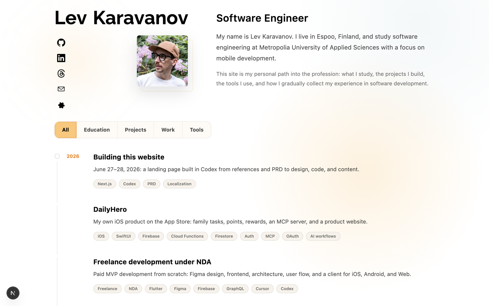

# Lev Karavanov - Personal Landing Page

[](https://nextjs.org/)
[](https://react.dev/)
[](https://www.typescriptlang.org/)
[](https://tailwindcss.com/)
[](https://pnpm.io/)
[](https://eslint.org/)

Personal developer landing page and portfolio built around a chronological timeline. Instead of splitting the story into separate experience and project sections, the site presents education, practice, projects, tools, and milestones as one continuous path.

Live site: [karavanov.fi](https://karavanov.fi/)



## Stack

- Next.js App Router
- TypeScript
- Tailwind CSS
- Local Markdown content
- English, Finnish, and Russian localization

## Features

- Timeline-first portfolio structure
- Inline expandable timeline details
- Direct links to timeline entries through `?entry=...`
- Light, dark, and system theme modes
- Language routes: `/en`, `/fi`, `/ru`
- SEO metadata, `robots.txt`, `sitemap.xml`, Open Graph, and JSON-LD
- Optional privacy-aware production analytics through Cloudflare Web Analytics
- Local reusable design tokens
- Mobile-first responsive layout
- Local social icons and fonts

## Project Structure

```txt
content/timeline/        Long-form localized timeline content
src/app/                 Next.js App Router routes and layouts
src/components/          UI, hero, layout, and timeline components
src/data/                Profile, locale, navigation, and timeline data
src/lib/                 Content, i18n, and theme helpers
src/styles/global.css    Tailwind import, theme tokens, and global styles
public/icons/            Local UI and social icons
public/fonts/            Local font files
docs/PRD.md              Product requirements and architecture notes
```

## Getting Started

```bash
pnpm install
pnpm dev
```

Open [http://127.0.0.1:3000](http://127.0.0.1:3000).

## Environment

Copy `.env.example` if production analytics should be enabled:

```bash
cp .env.example .env.local
```

```txt
NEXT_PUBLIC_CLOUDFLARE_WEB_ANALYTICS_TOKEN=
```

The analytics token is public by design. It is only used in production builds and should be left empty for local development unless analytics testing is intentional.

## Useful Scripts

```bash
pnpm lint
pnpm build
pnpm start
```

## Editing Content

Profile and hero copy live in:

```txt
src/data/profile.ts
```

Timeline metadata lives in:

```txt
src/data/timeline.ts
```

Long-form timeline stories live in:

```txt
content/timeline/<entry-slug>/<locale>.md
```

To add a new timeline entry:

1. Add metadata in `src/data/timeline.ts`.
2. Add localized Markdown files under `content/timeline/<entry-slug>/`.
3. Keep the slug stable once published.

## SEO And Analytics

Live URLs:

- Site: [https://karavanov.fi](https://karavanov.fi)
- Sitemap: [https://karavanov.fi/sitemap.xml](https://karavanov.fi/sitemap.xml)
- Robots: [https://karavanov.fi/robots.txt](https://karavanov.fi/robots.txt)

The site currently ships:

- localized routes for English, Finnish, and Russian
- server-rendered `<html lang="...">`
- localized title and description metadata
- canonical URLs and language alternates
- Open Graph and Twitter preview metadata
- `robots.txt`
- `sitemap.xml` with stable `lastmod` values and language alternates
- JSON-LD for the website, profile page, and person

Operational setup to keep outside the repo:

1. Verify `karavanov.fi` in Google Search Console with a DNS TXT record.
2. Submit `https://karavanov.fi/sitemap.xml`.
3. Submit or import the site in Bing Webmaster Tools.
4. Validate social previews after every major visual/metadata change.
5. Review Search Console and analytics data after the first 7-14 days.

Analytics is implemented as an optional Cloudflare Web Analytics integration. The code loads it only when `NEXT_PUBLIC_CLOUDFLARE_WEB_ANALYTICS_TOKEN` is present in a production build.

Cookie/consent decision: the intended analytics setup is privacy-friendly and should avoid cookies. If the analytics provider or settings are changed to something that stores cookies or collects personal data, add a visible cookie/consent flow and update this section before deploying.

## Public Repository Notes

This project is intended to be safe to inspect as a portfolio codebase. Before publishing, verify that:

- no `.env*` files are committed
- no API keys, tokens, or private keys are present
- placeholder contact details are replaced
- font and icon licenses are acceptable for public web use
- private school, customer, or work-practice artifacts are sanitized before being added

## License

No open-source license is currently provided. All rights reserved.

The code is published as part of a personal portfolio repository, but the personal text, photos, videos, screenshots, brand assets, and project media are not licensed for reuse. If the source code is later opened for reuse, it should use a separate code license and explicitly exclude personal content and media.
